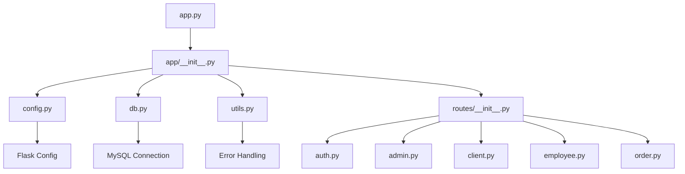

# Plan de Modularización del Código de la Aplicación de Restaurante

## Objetivo
Modularizar el código actual en `app.py` para separar responsabilidades en archivos individuales, mejorando la mantenibilidad, legibilidad y escalabilidad. Mantendremos consultas SQL directas para simplicidad.

## Estructura Propuesta
```
app/
├── __init__.py          # Inicialización del paquete
├── config.py            # Configuraciones de la aplicación
├── db.py                # Conexiones y funciones de base de datos
├── utils.py             # Funciones comunes (manejo de errores, etc.)
├── routes/
│   ├── __init__.py
│   ├── auth.py          # Rutas de autenticación (login, register, etc.)
│   ├── admin.py         # Rutas de administración (CRUD productos, estadísticas)
│   ├── client.py        # Rutas de cliente (dashboard, menú, carrito)
│   ├── empleado.py      # Rutas de empleados
│   └── order.py         # Rutas de pedidos
└── models/              # Si se decide migrar a ORM en el futuro
    └── __init__.py
```

## Lista de Tareas Detallada

1. **Analizar la estructura actual del código en app.py** ✅ Completado
   - Código monolítico con todas las rutas, configuraciones y lógica en un solo archivo.
   - Funciones de manejo de errores, configuración de DB, rutas de auth, admin, cliente, etc.

2. **Crear directorio de módulos (ej. 'app/')** ✅ Completado
   - Crear carpeta `app/` con `__init__.py` vacío.

3. **Separar configuración en config.py**
   - Extraer configuraciones de Flask, MySQL, uploads, Twilio a una clase `Config`.
   - Usar variables de entorno para credenciales sensibles.

4. **Crear archivo para conexiones y funciones de base de datos (db.py)**
   - Mover inicialización de MySQL a `db.py`.
   - Crear funciones helper para consultas comunes (ej. `get_user_by_email`, `insert_product`).

5. **Separar rutas en archivos individuales (routes/ con auth.py, admin.py, etc.)**
   - Agrupar rutas por funcionalidad:
     - `auth.py`: login, logout, register, forgot_password, verify_code, reset_password
     - `admin.py`: dashboard_admin, admin_crud, registrar_categoria, registrar_producto, eliminar_producto, editar_producto, admin_estadisticas
     - `client.py`: dashboard_cliente, menu, agregar_carrito, quitar_carrito, mesas, reservar_mesa
     - `employee.py`: empleados, add_empleado, logout_empleado
     - `order.py`: pedidos_entrantes, ver_pedido

6. **Crear blueprints para cada grupo de rutas**
   - Convertir cada archivo de rutas en un Blueprint de Flask.
   - Registrar blueprints en la aplicación principal.

7. **Mover lógica común a utils.py (manejo de errores, etc.)**
   - Mover función `manejar_error_db` a `utils.py`.
   - Agregar otras utilidades comunes si es necesario.

8. **Crear __init__.py para el paquete principal**
   - En `app/__init__.py`, crear función `create_app()` que inicialice la aplicación, registre blueprints y configure extensiones.

9. **Actualizar app.py para importar y registrar módulos**
   - Cambiar `app.py` para importar desde `app` y ejecutar `create_app()`.

10. **Probar la aplicación modularizada**
    - Ejecutar la aplicación y verificar que todas las rutas funcionen correctamente.
    - Revisar logs de errores y corregir importaciones faltantes.

## Diagrama de Arquitectura



## Beneficios de la Modularización
- **Mantenibilidad**: Cada módulo tiene una responsabilidad clara.
- **Reutilización**: Funciones comunes pueden ser reutilizadas.
- **Escalabilidad**: Fácil agregar nuevas funcionalidades sin modificar el código existente.
- **Colaboración**: Diferentes desarrolladores pueden trabajar en módulos separados.
- **Pruebas**: Más fácil probar módulos individuales.

## Consideraciones
- Mantener consultas SQL directas como solicitado.
- Asegurar que todas las importaciones sean correctas.
- Usar blueprints para evitar conflictos de rutas.
- Configurar variables de entorno para producción.

¿Estás de acuerdo con este plan? ¿Quieres hacer algún cambio antes de proceder a la implementación?